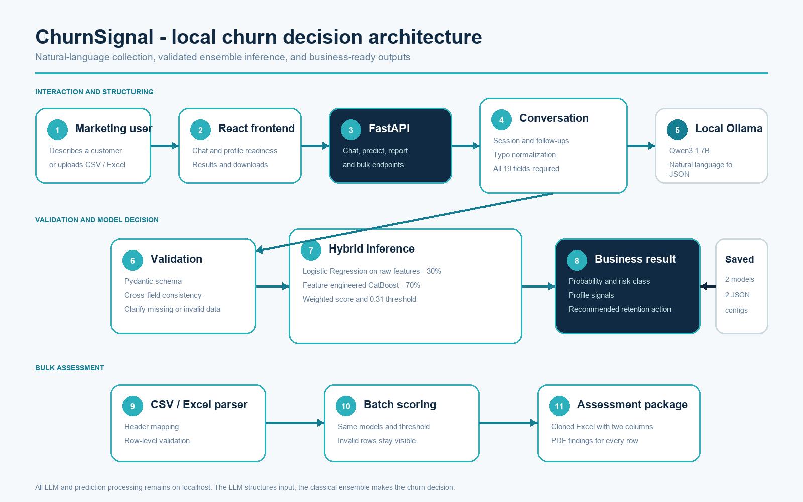
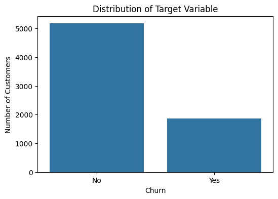
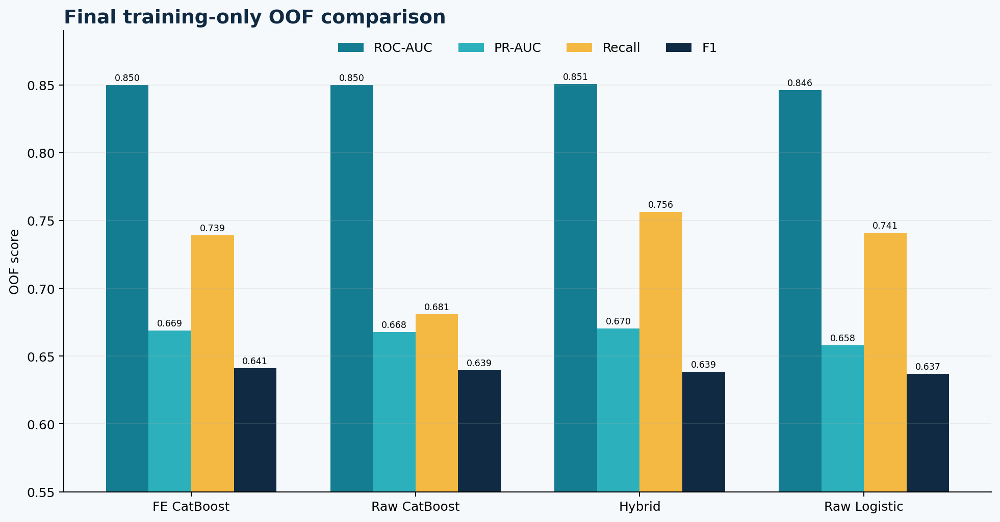
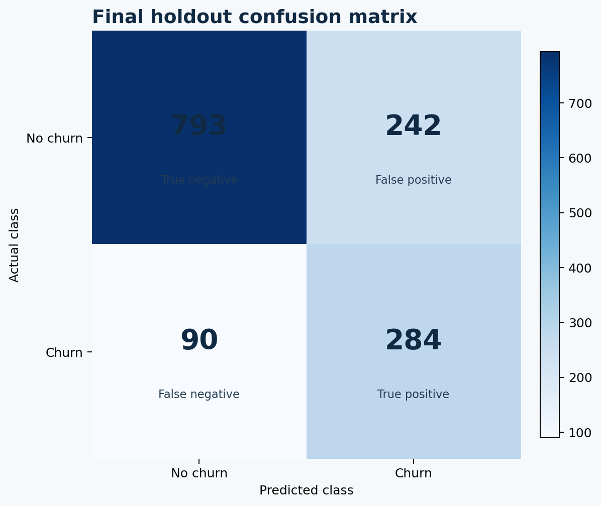
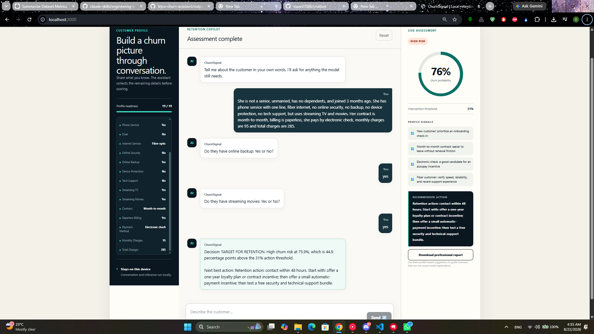
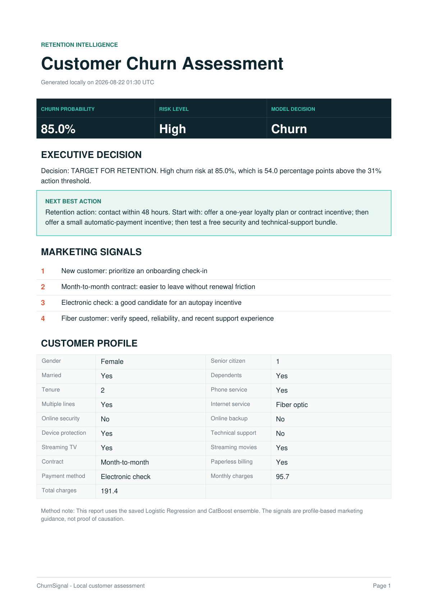
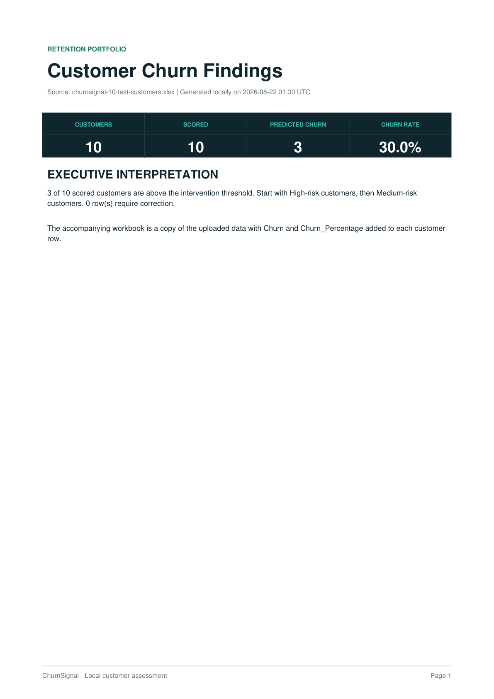
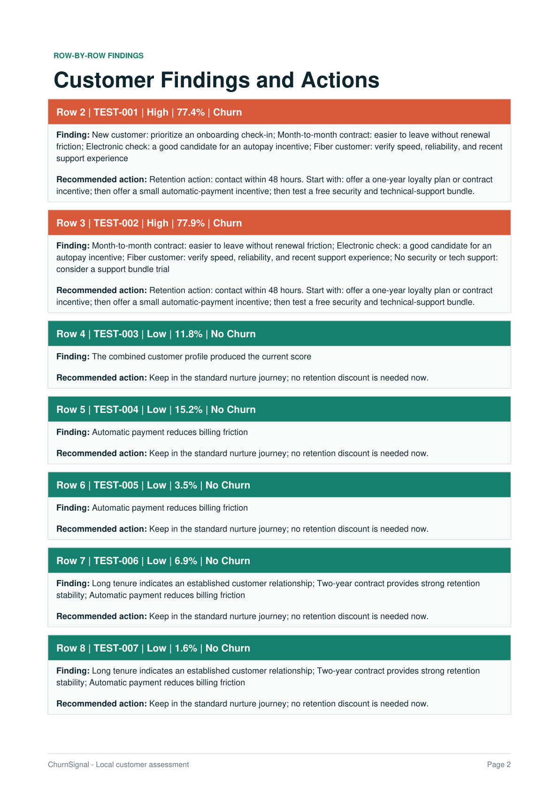

# ChurnSignal - Local AI-Powered Telco Churn Assistant

ChurnSignal is a proof of concept for predicting telecom customer churn and making the result usable by a marketing team. A local open-source LLM collects customer information in natural language, validates the complete 19-field profile, calls a classical machine-learning ensemble, and returns a churn score with a practical retention action.

The solution runs locally. Ollama structures the conversation; it does not replace the churn model or invent missing customer values.

## Assessment coverage

| Requested deliverable | Implementation |
|---|---|
| Churn classification model | Logistic Regression and CatBoost ensemble trained and evaluated in `notebooks/etislat.ipynb` |
| Conversational model-input pipeline | Stateful 19-field collection and clarification flow in `src/chatbot.py` |
| Open-source LLM | Local `qwen3:1.7b` through Ollama |
| Structured natural-language extraction | Pydantic-constrained JSON patch extraction plus deterministic typo and shorthand normalization |
| API | FastAPI endpoints for health, prediction, chat, reset, reports, and bulk scoring |
| Understandable result | Probability, threshold comparison, risk level, profile signals, and next-best action |
| Architecture diagram | `diagram/system-architecture.png`, with editable SVG and Mermaid source |
| Supporting evidence | Notebook figures in `imgs/`, the concise submission report, and the complete repository guide in `output/pdf/` |

## Technical and business motivation

### Business motivation

The client needs more than a classifier hidden in a notebook. The marketing team needs a usable decision-support workflow: identify customers who deserve attention, rank them by model-estimated risk, understand how the score compares with the intervention threshold, and receive a practical next action.

| Business need or risk | ChurnSignal response | Why it matters |
|---|---|---|
| Identify likely churners before they leave | Continuous risk score plus a Churn/No Churn decision | Marketing can rank customers and construct a campaign list |
| Missing a churner may cost more than an unnecessary contact | Recall-oriented hybrid model and 0.31 OOF threshold | The final holdout catches about 76% of actual churners while precision remains about 54% |
| Marketing users should not construct model JSON manually | Conversational collection of all 19 model inputs | Reduces technical friction while preserving the trained schema |
| A probability alone is not actionable | Threshold comparison, risk band, profile signals, recommended action, and PDF | Converts the score into a retention-review input |
| Customer conversation text should remain local | Open-source Qwen3 1.7B served through Ollama | Avoids transmitting customer text to a hosted third-party LLM |
| Campaigns contain many customers | CSV/XLSX scoring with a cloned workbook and row-level findings report | Supports portfolio triage and retains invalid-row reasons |

The recommendations are decision-support suggestions, not automated treatment decisions or causal claims. Production must incorporate real customer value, churn loss, contact and offer cost, campaign capacity, consent, and contact-policy constraints.

### Technical motivation

The implementation separates language understanding from statistical prediction. Deterministic rules and the local LLM extract only explicit facts into a constrained schema. Pydantic validates those facts. The frozen Logistic Regression and CatBoost ensemble alone computes churn. This keeps predictions reproducible, testable, and independent of prompt wording.

- **Stratified train/test plus CV/OOF:** the dataset has only 7,043 rows, so 80% is used for development with repeated internal validation while 20% remains an untouched final test. A third static validation partition would reduce the data available for learning.
- **Leakage-safe preprocessing:** one-hot encoding and scaling are fitted inside each cross-validation fold rather than on the complete dataset.
- **Visible model comparison:** Logistic Regression, Decision Tree, Random Forest, XGBoost, and CatBoost test linear, bagged-tree, and boosted-tree hypotheses before finalists are selected.
- **Native CatBoost evaluation:** CatBoost is re-evaluated using its intended categorical handling instead of being judged only after one-hot encoding.
- **OOF selection:** ensemble weights and the action threshold are chosen from predictions made by fold models that did not train on the scored rows. The final test labels are never used for selection.
- **Hybrid ensemble:** 30% tuned raw-feature Logistic Regression contributes stable additive structure; 70% feature-engineered CatBoost contributes non-linear categorical interactions. The blend has the strongest final OOF ROC-AUC, PR-AUC, and recall, with F1 close to the best candidate.
- **Strict serving contract:** saved feature and ensemble configuration files preserve feature order, engineered features, weights, and threshold. Pydantic rejects malformed or logically impossible profiles.
- **Deterministic-first chatbot:** rules handle common answers, ordered replies, corrections, synonyms, and typos; Ollama handles language that benefits from semantic extraction.
- **One inference path:** JSON prediction, chat, reports, and bulk files all call the same saved artifacts and inference functions.

Hosted LLMs, LLM-based churn prediction, RAG, vector databases, Kubernetes, feature stores, and automated retraining are deliberately excluded. They add privacy, cost, operational, or governance complexity without improving the required localhost PoC. The detailed repository guide explains when each would become appropriate.

## Alignment with the client's requirements

This matrix maps every specification and deliverable in the client brief directly to implementation evidence.

| Client requirement | How ChurnSignal satisfies it | Evidence | Status |
|---|---|---|---|
| Build a classical churn classification model | Compares five model families, tunes finalists, selects a Logistic/CatBoost probability ensemble, and evaluates it once on an untouched holdout | `notebooks/etislat.ipynb`, `models/` | Met |
| Use the supplied dataset | Audits, cleans, and models the supplied 7,043-row, 21-variable telco dataset | `Data/`, notebook data audit | Met |
| Explain model choice, feature engineering, and training | Documents the baseline, comparisons, tuning, six engineered features, OOF weighting, threshold selection, and final test | Notebook, README, both PDFs in `output/pdf/` | Met |
| Gather model inputs through conversation | Stores session state, extracts explicit facts, asks grouped follow-up questions until all 19 fields validate, and supports corrections | `src/chatbot.py`, `src/schemas.py`, tests | Met |
| Use an open-source model instead of a closed third-party LLM | Runs `qwen3:1.7b` locally through Ollama; no hosted LLM API is required | Ollama configuration and `/health` | Met |
| Translate marketing language into structured data | Combines deterministic normalization with Pydantic-constrained `CustomerPatch` extraction | `src/chatbot.py`, `tests/test_chatbot.py` | Met |
| Present understandable results | Returns class, probability, 31% threshold comparison, risk band, profile signals, recommended action, interpretation note, and PDF | Chat response, frontend, demo artifacts | Met |
| Deploy the solution as an API | Exposes health, predict, chat/reset, report, and bulk endpoints through FastAPI | `src/Api.py`, `/docs`, API tests | Met |
| Provide an architecture and data-flow diagram | Supplies Mermaid source plus editable SVG and presentation PNG | `diagram/system-architecture.*` | Met |
| Document technical and business motivations | Connects model, threshold, privacy, validation, and delivery choices to campaign risk and usability | Motivation sections above and both project PDFs | Met |
| Explain alignment with client requirements | Provides this explicit requirement-to-evidence matrix and the equivalent PDF chapter | This section and both project PDFs | Met |
| Keep the solution simple while allowing suitable libraries | Uses a local three-process PoC: Ollama, FastAPI, and React; avoids unjustified cloud and MLOps infrastructure | Architecture, tools table, PoC boundaries | Met |

Bulk spreadsheet scoring and professional single/bulk PDF reports are value-added features. They improve marketing usability but are not treated as substitutes for any mandatory deliverable.

## Tools and libraries

The complete Python environment is pinned in `requirements.txt`; direct frontend dependencies and scripts are declared in `frontend/package.json`, and the exact JavaScript graph is locked in `frontend/package-lock.json`.

| Area | Tool or library | Role and reason for selection |
|---|---|---|
| Runtime | Python 3.9 | Shared language for analysis, training artifacts, validation, API, bulk processing, and reports |
| Notebook | JupyterLab / IPython | Preserves the assessment's chronological trial-and-error, figures, outputs, and artifact export |
| Tabular computing | pandas 2.3.3, NumPy 2.0.2 | Cleaning, feature frames, numerical operations, and vectorized batch preparation |
| Statistics | SciPy 1.13.1 | Chi-square, Mann-Whitney U, association measures, and non-parametric analysis |
| Visualization | Matplotlib 3.9.4, Seaborn 0.13.2 | EDA, threshold curves, comparisons, and confusion matrices |
| Classical ML | scikit-learn 1.6.1 | Splits, leakage-safe pipelines, encoding, scaling, baselines, models, CV, tuning, and metrics |
| Boosting | CatBoost 1.2.10, XGBoost 2.1.4 | Boosted-family comparison and the selected native categorical model |
| Serialization | joblib 1.5.3, CatBoost model format, JSON | Saves both fitted models plus feature, weight, and threshold contracts |
| API | FastAPI 0.128.8, Uvicorn 0.39.0 | Typed lightweight REST service, local ASGI server, and OpenAPI documentation |
| Validation | Pydantic 2.13.4 | Exact schemas, categories, ranges, dependency rules, and structured LLM output validation |
| Local LLM | Ollama with Qwen3 1.7B | Small open-source extraction model running locally without hosted-provider data transfer |
| LLM HTTP | HTTPX 0.28.1 | Asynchronous Ollama calls with configured timeout and error handling |
| Uploads and Excel | python-multipart 0.0.20, openpyxl 3.1.5 | Multipart CSV/XLSX upload and Excel workbook recreation |
| PDF | ReportLab 4.4.3, pypdf 6.0.0 | Local deterministic PDF generation and document verification |
| Backend QA | pytest 8.4.2 | Regression tests for API, validation, chat, corrections, reports, and bulk scoring |
| Frontend | React 19.2.6, React DOM 19.2.6, TypeScript 5.9.3 | Typed stateful conversation, readiness, results, reports, and bulk UI |
| Frontend build | vinext 1.0.0-beta.2, Vite 8.0.13 | Local development and production compilation for the selected scaffold |
| Frontend QA | ESLint 9.39.4, Node test runner | Static checks and rendered-content smoke tests |
| Architecture | Mermaid with PNG/SVG exports | Editable architecture source and portable documentation assets |

## Architecture



The interaction path is deliberately separated into two responsibilities:

1. **Language layer:** the chatbot and local LLM extract only customer facts, normalize them to the training schema, remember confirmed values, and request missing or conflicting fields.
2. **Decision layer:** the saved classical models calculate the churn score. This keeps the prediction deterministic, testable, and independent from LLM wording.

The complete source diagram is available as:

- `diagram/system-architecture.png` - presentation-ready image.
- `diagram/system-architecture.svg` - editable vector asset.
- `diagram/system-architecture.mmd` - Mermaid source.

## Dataset and problem definition

- **Rows:** 7,043 customers.
- **Original columns:** 21.
- **Target:** `Churn`, mapped from Yes/No to 1/0.
- **Positive class:** 1,869 churners, or 26.54% of the dataset.
- **Negative class:** 5,174 retained customers, or 73.46%.
- **Model inputs:** 19 fields after excluding `Customer_ID` and the target.

The imbalance explains why accuracy is not used alone. A model predicting "No Churn" for everyone would be about 73.46% accurate while catching zero churners.



## Notebook workflow and why each stage exists

| Stage | What is done | Why it is necessary |
|---|---|---|
| Schema inspection | Shape, samples, dtypes, column names, unique values, and target counts | Detects parsing problems and establishes what one row represents |
| Header cleaning | Leading and trailing whitespace is removed | Prevents schema and inference failures caused by visually hidden characters |
| `Total_Charges` repair | Blank strings are converted to missing numeric values; the 11 zero-tenure rows are filled with 0 | Uses a domain-consistent value instead of blind median imputation |
| Integrity checks | Missingness, duplicates, unique customer IDs, and phone/internet dependency rules | Prevents logically impossible profiles and accidental identifier leakage |
| EDA | Numeric distributions, category counts, churn-conditioned plots, and outlier views | Shows class imbalance, skew, segment behavior, and candidate relationships |
| Statistical tests | Chi-square plus Cramer's V, Mann-Whitney U plus rank-biserial effect, and Spearman correlation | Separates statistical evidence from practical effect size without relying on normality |
| Holdout split | Stratified 80/20 split using `random_state=42` | Preserves churn prevalence and protects 1,409 customers for final evaluation |
| Pipeline preprocessing | One-hot encoding and scaling are fitted inside cross-validation | Prevents validation-fold leakage and stabilizes Logistic Regression optimization |
| Baseline | Most-frequent DummyClassifier | Proves why accuracy alone is misleading |
| Model screening | Logistic Regression, Decision Tree, Random Forest, XGBoost, and CatBoost | Compares linear, bagged, and boosted hypotheses before selecting finalists |
| Tuning | Grid search for the small Logistic space and randomized search for CatBoost | Matches search cost to the size of each hyperparameter space |
| OOF prediction | Every training row is scored by a fold model that did not train on it | Enables honest ensemble-weight and threshold selection without touching the test set |
| Feature engineering | Six domain summaries are created | Makes service depth, support coverage, newness, and payment behavior explicit |
| Ensemble | Raw Logistic probability and feature-engineered CatBoost probability are blended | Combines stable linear structure with non-linear interactions |
| Threshold selection | The action threshold is selected from training-only OOF scores | Converts ranking quality into a business operating point without test leakage |
| Final test | Frozen models, weights, and threshold are evaluated once | Produces the unbiased final PoC estimate |
| Persistence parity | Models and JSON configuration are saved, reloaded, and compared | Proves that API inference reproduces notebook inference |

## Feature engineering

| Feature | Definition | Intended signal |
|---|---|---|
| `Num_Services` | Count of six active add-on services | Overall product depth and switching friction |
| `Num_Support_Services` | Security, backup, device protection, and tech support count | Protective support coverage |
| `Num_Streaming_Services` | Streaming TV plus streaming movies | Entertainment engagement |
| `Is_New_Customer` | Tenure less than or equal to six months | Early-life churn exposure |
| `Auto_Payment` | Automatic bank transfer or automatic credit card | Lower billing friction |
| `No_Security_And_No_Support` | No online security and no technical support | Explicit high-risk service interaction |

The engineered CatBoost gain is intentionally reported as small. Tree models can already learn many interactions from raw flags, so a large improvement was neither assumed nor claimed.

## Model comparison

All values below come from training-only out-of-fold predictions. Each candidate receives its own selected threshold, so one model is not unfairly compared at 0.50 while another uses an optimized cutoff.

| Candidate | ROC-AUC | PR-AUC | Threshold | Precision | Recall | F1 |
|---|---:|---:|---:|---:|---:|---:|
| Feature-engineered CatBoost | 0.8500 | 0.6688 | 0.33 | 0.5661 | 0.7391 | **0.6411** |
| Raw CatBoost | 0.8498 | 0.6677 | 0.38 | **0.6027** | 0.6809 | 0.6394 |
| **Hybrid ensemble** | **0.8505** | **0.6705** | **0.31** | 0.5525 | **0.7565** | 0.6386 |
| Raw Logistic Regression | 0.8459 | 0.6581 | 0.33 | 0.5582 | 0.7411 | 0.6368 |



### Why the hybrid ensemble is selected

The hybrid model is preferred from a business-risk perspective because it achieves the highest recall while maintaining nearly the same F1 score as the other finalists. It also has the highest ROC-AUC and PR-AUC in the final OOF comparison.

This is not a claim that the hybrid dominates every metric. Feature-engineered CatBoost has a slightly higher F1, and raw CatBoost has higher precision. The hybrid is selected because missing a real churner is assumed to be more costly than contacting some customers who would have stayed. The production choice must therefore be revisited when the real costs of false negatives, false positives, offer value, and campaign capacity are known.

## Final holdout performance

The frozen 30% Logistic / 70% CatBoost blend and 0.31 threshold produce:

| Metric | Holdout result | Business interpretation |
|---|---:|---|
| Accuracy | 76.44% | Overall label correctness |
| Precision | 53.99% | About 54 of every 100 contacted customers are actual churners |
| Recall | 75.94% | About 76 of every 100 actual churners are identified |
| F1 | 63.11% | Precision-recall balance at the selected action threshold |
| ROC-AUC | 84.65% | Strong ranking of churners above non-churners across thresholds |

The confusion matrix contains 793 true negatives, 242 false positives, 90 false negatives, and 284 true positives. The model catches 284 of 374 actual churners and creates a retention queue of 526 customers.



## Conversational flow

1. The user describes any known customer details in ordinary language.
2. Deterministic parsing handles common shorthand, typos, numeric answers, and ordered multi-answer replies.
3. Ollama returns a structured patch constrained by the Pydantic schema.
4. Confirmed values are stored for the session.
5. Relationship rules automatically handle "No phone service" and "No internet service" dependencies.
6. The assistant asks only for missing, invalid, or conflicting fields.
7. Prediction starts only when all 19 model inputs validate.
8. The API returns the model score, class, threshold, business signals, and recommended action.

The profile signals are operational guidance derived from the validated profile. They are not causal explanations and should not be presented as proof that a specific offer will prevent churn.

## Bulk scoring

The optional bulk path accepts `.csv` or `.xlsx`, maps known header aliases, uses Ollama only for unfamiliar headers, validates each row independently, and scores valid rows in one vectorized model call.

The downloaded ZIP contains:

- A cloned Excel workbook with `Churn` and `Churn_Percentage` appended.
- A PDF containing the finding and suggested action for every source row.
- Invalid rows retained as `Error` rather than silently deleted.

Limits are 15 MB and 20,000 customer rows per upload.

## Verified end-to-end demonstration

The following evidence was produced by the running local application, using the saved ensemble and local Ollama `qwen3:1.7b`. The complete reproducible artifact set is indexed in [`output/demo/README.md`](output/demo/README.md).

### Live conversational interface

The screenshot below is the primary UI evidence for the assessment submission. It demonstrates the complete workflow in one frame: a natural-language customer description, follow-up questions for missing details, 19/19 profile readiness, the final 75.9% high-risk score, the 31% intervention threshold, profile-based marketing signals, the recommended retention action, and the professional-report download control.

This screenshot is a separate live customer example from the reproducible 76.0% report demonstration below; the values are intentionally documented as two different runs.



### Prompt-based single-customer assessment

The successful demonstration used one natural-language prompt containing all 19 required customer fields. The assistant extracted a complete profile and returned:

| Result | Value |
|---|---:|
| Completed fields | 19 / 19 |
| Predicted class | Churn |
| Churn probability | 76.0% |
| Action threshold | 31.0% |
| Risk level | High |
| Recommended timing | Contact within 48 hours |

The exact prompt, extracted profile, and response summary are preserved in [`prompt-result.json`](output/demo/single/prompt-result.json). The generated professional report is [`churnsignal-customer-assessment.pdf`](output/demo/single/churnsignal-customer-assessment.pdf).



### Ten-customer bulk assessment

The bulk demonstration uploaded an Excel workbook containing 10 customer profiles. All rows validated and scored successfully.

| Result | Value |
|---|---:|
| Uploaded rows | 10 |
| Successfully scored | 10 |
| Invalid rows | 0 |
| Predicted churn | 3 |
| Portfolio churn rate | 30.0% |

The returned package is preserved as [`churnsignal-assessment-package.zip`](output/demo/bulk/churnsignal-assessment-package.zip). It contains a cloned workbook with `Churn` and `Churn_Percentage` appended and a three-page findings report covering every row.





The individual files are also available directly:

- [Bulk input workbook](output/demo/bulk/input/churnsignal-10-test-customers.xlsx)
- [Scored output workbook](output/demo/bulk/package/churnsignal-10-test-customers-with-churn.xlsx)
- [Bulk findings PDF](output/demo/bulk/package/churnsignal-10-test-customers-findings.pdf)
- [Bulk result summary](output/demo/bulk/summary.json)

## Run locally

### Prerequisites

- Python 3.9 or compatible environment used by the project.
- Node.js 22.13 or newer for the frontend.
- Ollama with `qwen3:1.7b` installed.

```powershell
ollama pull qwen3:1.7b
```

### 1. Start the API

From the repository root:

```powershell
.\.venv\Scripts\Activate.ps1
uvicorn src.Api:app --reload --host 127.0.0.1 --port 8000
```

Health check: `http://127.0.0.1:8000/health`  
Interactive API schema: `http://127.0.0.1:8000/docs`

### 2. Start the frontend

In another terminal:

```powershell
cd frontend
npm install
npm run dev
```

Open `http://127.0.0.1:3000`.

### 3. Run backend tests

```powershell
.\.venv\Scripts\python.exe -m pytest -q
```

Current verified result: **23 passed**.

## API surface

| Method | Endpoint | Purpose |
|---|---|---|
| GET | `/health` | API and local Ollama readiness |
| POST | `/predict` | Structured single-customer prediction |
| POST | `/chat` | Stateful conversational collection and prediction |
| DELETE | `/chat/{session_id}` | Reset one conversation |
| POST | `/report` | Generate one customer assessment PDF |
| POST | `/bulk-predict` | Score CSV/Excel and return an Excel/PDF ZIP package |

## Project structure

```text
telco-churn-assistant/
|-- Data/                  Source telco churn dataset
|-- notebooks/             Executed analysis and training notebook
|-- models/                Logistic, CatBoost, ensemble, and feature artifacts
|-- src/                   FastAPI, chatbot, validation, inference, bulk, reports
|-- frontend/              ChurnSignal web interface
|-- tests/                 Backend API and chatbot tests
|-- imgs/                  Notebook figures, result figures, and UI evidence
|-- diagram/               Architecture PNG, SVG, and Mermaid source
|-- output/pdf/            Concise report and complete repository guide
|-- requirements.txt       Python environment dependencies
`-- README.md              Project guide
```

## Saved inference contract

| Artifact | Responsibility |
|---|---|
| `models/logistic_raw.joblib` | Raw-feature preprocessing and tuned Logistic Regression |
| `models/catboost_feature_engineered.cbm` | Tuned feature-engineered CatBoost |
| `models/ensemble_config.json` | 0.30/0.70 weights, positive class, and 0.31 threshold |
| `models/feature_config.json` | Exact raw, engineered, categorical, and numerical feature lists |

Serving must load all four artifacts. Saving only the classifiers would lose feature order, ensemble policy, or the chosen decision threshold.

## PoC boundaries

- The split is random because the dataset contains no event timestamp; production should validate on a later time period.
- OOF evaluation is appropriate for this PoC, while nested CV would provide a stricter model-selection estimate.
- Probability calibration is not measured, so the percentage should be treated as a model-estimated churn risk.
- Chat sessions are stored in process memory and reset when the API restarts.
- Production deployment would add authentication, persistent state, latency/error monitoring, data drift, prediction drift, and delayed-label performance monitoring.
- The current threshold must be re-optimized when actual campaign costs and retention capacity are available.

## Additional evidence

All 19 notebook and documentation figures are indexed in [`imgs/README.md`](imgs/README.md). The concise submission report is `output/pdf/telco-churn-poc-report.pdf`; the detailed handover is `output/pdf/churnsignal_complete_repository_guide.pdf`.
